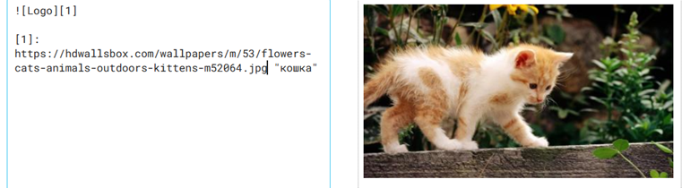

# Markdown
\Markdown - это облегченный язык разметки, который используется для форматирования текста. Он широко используется в программировании и других областях, где требуется быстрое и удобное форматирование текста. 
1. Заголовки: Markdown поддерживает шесть уровней заголовков. Для создания заголовка используются символы #. Чем больше символов, тем меньше уровень заголовка. Например:
```
   # Заголовок 1 (H1)
   ## Заголовок 2 (H2)
   ### Заголовок 3 (H3)
   #### Заголовок 4 (H4)
   ##### Заголовок 5 (H5)
   ###### Заголовок 6 (H6)
```
3. Списки: Создание списков в Markdown очень просто. Для создания ненумерованного списка используются символы -, *, или +. Для создания нумерованного списка используются цифры и точка. Например:
   ```
   1. Элемент списка 1
   2. Элемент списка 2
   3. Элемент списка 3
   ```
5. Ссылки: Для создания ссылок в Markdown используется следующий синтаксис:
[текст ссылки](URL). Например: [Google](http://google.com).
7. Для вставки изображений в Markdown используется следующий синтаксис:


